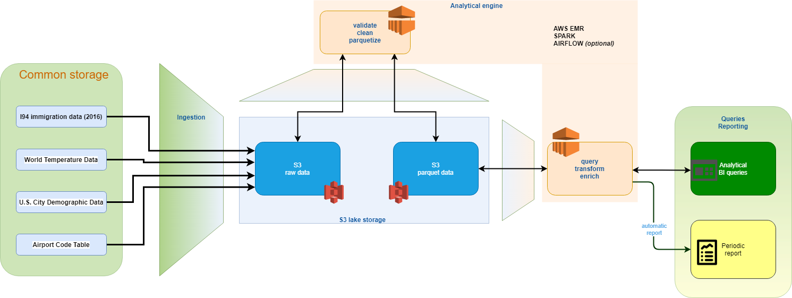

# Udacity Data Engineering Nanodegree
## Capstone project: data lake with S3 and EMR

In this project a data lake with S3 and EMR on AWS has been designed.

The dataset used comes from the [US National Tourism and Trade Office](https://www.trade.gov/national-travel-and-tourism-office), and is going to be used from a fictitious organization for tourism development (OTD), that want to analyze the migration flux in the USA. Running periodic queries and placing the results of these queries in a dashboard. The dashboard is not part of this work, but examples of queries that can be run on data have been given.

### The implementation

The architecture shown above has been implemented. 

- Starting from a **common storage** (currently Udacity workspace) where both the OTD and its partners have access, the data is transferred to an **S3 bucket**, in raw format

- The data transferred is immediately processed, validated and cleansed using a **Spark cluster** and stored into S3 in **parquet** format. Raw and parquet data formats coesist in the data lake.

- The **EMR** cluster serves the analytical needs of the project, with in-place queries of the data. SQL based queries are performed using **Spark SQL** directly on the S3 parquet data

### The files
The project shown here contains a mix of code that runs locally and other that runs in remote EMR cluster.

This is done for simplicity. In the final production code, everything is supposed to run on remote machines.

#### The dataset
- I94 immigration data from the US National Tourism and Trade Office.
- The airport codes dataset, stored not used
- Global land temperature dataset, stored not used
- U.S. City Demographic Data, stored not used

#### Local files
Detailed project information with the core code developed are in **Capstone Project 1.ipynb**. The Jupyter notebook has to be intented as a preliminary work, not a production-ready software.

**config.cfg** contains AWS, S3, EMR configuration parameters.

More production-ready scripts have been included in the project:
- **emr_cluster_spark_submit.py** and **lib/emr_cluster.py** are used to provision the EMR cluster and add the steps to perform the Spark jobs. 

In the file **Capstone Project 1 - Querying the Data Lake.ipynb** there are some queries to be run on the data.

#### Cloud file
These files are stored in the S3 bucket of the project:
- config.cfg configuration parameters, keep in sync with the local copy
- cluster_bootstrap.sh installs needed python packages after EMR bootstrap
- spark_4_emr_codes_extraction.py to extract codes from text
- spark_4_emr_I94_processing.py to clean and validate the I94 data
- spark_4_emr-Queries.py contains the queries on the EMR cluster

#### Using the files
Run `python emr_cluster_spark_submit.py` to provision the EMR cluster and create the data lake storage (raw and parquet data).

Run `python emr_cluster_submit-Queries.py` to run the predefined query on the EMR cluster.

## Other References

### VISAPOST
https://fam.state.gov/fam/09FAM/09FAM010205.html

### VISATYPE - Class of admission
https://www.dshs.wa.gov/sites/default/files/ESA/eaz-manual/USCIS%20I-94%20Table.pdf