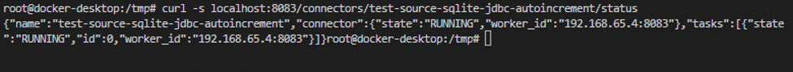

- Start the Docker Container and Open a New Shell Inside
- Start Kafka
- Install SQLite3 and Create a New Database Table
- Insert at Least Two New Values into Your New Database Table
- Start Kafka Connect in Standalone Mode
- Verify the Connectors and Topic Have Been Created
- Start a Kafka Consumer and Write New Data to the Database


### Start the Docker Container and Open a New Shell Inside

To start a docker container
`docker run -it <image_name>`

The reference to docker run is [here](https://docs.docker.com/engine/reference/run/)

In my case I want to run an image of the confluent platform containing all components I need:
`docker run -ti --rm --name sqlite-demo --network host confluentinc/docker-demo-base:3.3.0`

`--name` to specify a container name
`--network` to create a network, all the containers in the network can communicate among themselves

After launching the above docker command you get a terminal into the container.

if you get an error, here are some docker commands that can help by debbugging:
- `docker container ls`
- `docker container stop <container name>`
- `docker container rm <container name>`


#### Stat confluent kafka

This start the connect service in distributed mode. 

```
cd /tmp
confluent start
```


Among the components that have been launched there is **Kafka connect**. By default it is launched in distributed mode and using port 8083.

By default kafka connect use port 8083. To use kafka connect in standalone mode I need to stop the service to free the port. Otherwise you get an error.

Stop connect first:
`confluent stop connect`

Now I can start the worker in standalone mode, and as a daemon:
`connect-standalone -daemon /etc/schema-registry/connect-avro-standalone.properties /etc/kafka-connect-jdbc/source-quickstart-sqlite.properties`

Check the log to verify that it started correctly:
`cat /logs/connectStandalone.out | grep -i "finished"`

#### Check the Connectors

Each connector is a process that run in a JVM. To check which connectors are running use:
`curl -s localhost:8083/connectors`


#### install SQLite3 


```
apt-get update
apt-get install sqlite3
```

### Create a new database

`sqlite3 test.db`

### Create a new Table


`CREATE TABLE IF NOT EXISTS accounts (id INTEGER PRIMARY KEY AUTOINCREMENT NOT NULL, name VARCHAR(255));`

Mind the semicolon at the end of the command

Verify the table has been create with:

`.tables`

### Insert values in the table


```
INSERT INTO accounts (name) VALUES ('chad');
INSERT INTO accounts (name) VALUES ('terry');
```

Verify that the records have been inserted in the table **accounts**:

`SELECT * FROM accounts`

with the above query all existing record are shown.


### Connect the worker to read from the sqlite database

To launch the worker in standalone mode use the command:
`bin/connect-standalone worker.properties connector1.properties [connector2.properties connector3.properties ...]`
The first parameter is `worker.properties` and contains the configurations properties of the worker.

Configuration parameters can be found on this [page](https://docs.confluent.io/platform/current/connect/references/allconfigs.html)

Somegvworker properties files samples are already included in the Confluent platform. For example 
`/etc/schema-registry/connect-avro-standalone.properties`

In particular the properties file above use the Avro converter that integrate with the Schema Registry. Mind that the Schema Registry server must be running.

Launch the worker in standalone mode:
`connect-standalone -daemon /etc/schema-registry/connect-avro-standalone.properties /etc/kafka-connect-jdbc/source-quickstart-sqlite.properties`

In the file `/etc/kafka-connect-jdbc/source-quickstart-sqlite.properties` there is the configuration of the connector.
Among the other the url of the broker and the topic to assign the data to.

Now I have that the connector from the database to Kafka acts as producer.

What I need now is a consumer to get the data out of Kafka.

### JDBC connector configuration

The sqlite database is a source for Kafka stream. The connector used is a jdbc connector, which properties are in `/etc/kafka-connect-jdbc/source-quickstart-sqlite.properties`.

In the properties file  

### Consume the data

Kafka has available some ready to use consumer that just print out on screen the data from a specific `kafka-avro-console-consumer --new-consumer --bootstrap-server localhost:9092 --topic test-sqlite-jdbc-accounts --from-beginning`


### Troubleshooting

Check the log, especially useful if something went wrong

`cat /logs/connectStandalone.out`

An error I had, may be because I run the confluent platform multiple times, is the following (copied from the log):

```
WARN FAILED ServerConnector@65b863b9{HTTP/1.1}{0.0.0.0:8083}: java.net.BindException: Address already in use (org.eclipse.jetty.util.component.AbstractLifeCycle:212)
java.net.BindException: Address already in use
```


#### Status of a connector

curl -s localhost:8083/connectors/
answer:
```
["test-source-sqlite-jdbc-autoincrement"]
```
To ask the status of the connector send a GET request to the REST API of kafka connect:

`curl -s localhost:8083/connectors/test-source-sqlite-jdbc-autoincrement/status`

and this can be the answer:



